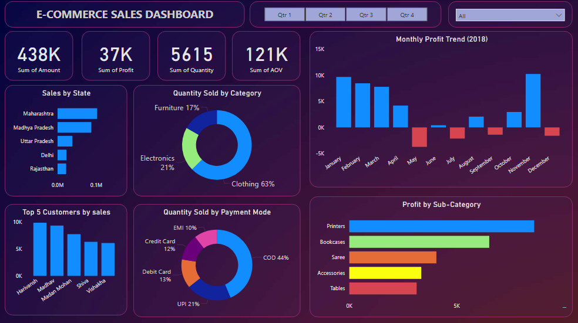

<h1 align="center">📊 E-commerce Sales Dashboard (Power BI)</h1>

## 🔹 Overview
This project is an **interactive Power BI dashboard** built to analyze e-commerce sales performance across India.  
The dashboard provides a comprehensive view of **sales, profit, customer behavior, product categories, and payment modes** to support data-driven business decisions.

## 🔹 Objective
The goal of this project is to enable the store owner to:  
- Track **overall sales performance** (Revenue, Profit, Orders).  
- Identify **top-performing customers, states, and product categories**.  
- Analyze **monthly profit trends** and detect periods of negative profit.  
- Compare **quantity sold across categories and payment methods**.  
- Support **strategic decisions** with actionable insights.

## 🔹 Files in this Repository
- **data/**  
  - [orders.csv](data/Orders.csv) – Order-level data including customer and location details.  
  - [details.csv](data/Details.csv) – Transaction-level data including amount, profit, quantity, category, sub-category, and payment mode.  
- **dashboard/**  
  - [E-commerce Sales Dashboard.pbix](dashboard/ecommerce%20sales%20dashboard.pbix) – Power BI Desktop file with the interactive dashboard.  
  - [E-commerce Sales Dashboard.pdf](dashboard/ecommerce%20sales%20dashboard.pdf) – Exported PDF version of the dashboard.  
- **screenshots/**  
  - [dashboard_full.png](screenshots/dashboard1.png) – Full dashboard view with all filters cleared.  
  - [dashboard_state.png](screenshots/dashboard_state.png) – Dashboard filtered by state.  
  - [dashboard_quarter.png](screenshots/dashboard_quarter.png) – Dashboard filtered by quarter.  
- **README.md** – Project documentation.  

## 🔹 Dataset
The dashboard uses **two CSV files**:  
- Orders data containing customer and location information.  
- Details data containing transaction and product-level information.  

Both tables are linked via `OrderID` to enable comprehensive analysis. 

## 🔹 Dashboard Preview
### Full Dashboard (All Filters Cleared)
  

👉 More screenshots available in the [screenshots folder](screenshots/).  

    
## 🔹 Insights & Findings

- **Overall Performance (KPIs):**  
  - Total Sales: ₹438K  
  - Total Profit: ₹37K  
  - Total Quantity Sold: 5,615 units  
  - Average Order Value (AOV): ₹121K  

- **Customer Analysis:**  
  - Top 5 customers contribute significantly to revenue.  
  - 5th top customer is the highest spender in Clothing, while 3rd is top in Electronics.  

- **Category Insights:**  
  - Clothing drives majority of **quantity** sold but contributes equal profit as Electronics.  
  - Electronics (Printers & Accessories) deliver the **highest profit**, despite lower sales volume.  
  - Furniture (Bookcases) is the most profitable item in its category.  

- **State Insights:**  
  - Maharashtra leads sales across India, followed by MP and UP.  
  - Northern states like Delhi & Rajasthan also contribute strongly.  

- **Profitability Trends:**  
  - November is peak profit month; May and July show major losses.  
  - Furniture shows **no negative profit in September**, unlike other categories.  

- **Payment Mode Analysis:**  
  - COD dominates (44%), followed by UPI (21%).  
  - EMI is least preferred (10%).  

  

## 🔹 Strategy & Actionable Business Insights
1. **Target High-Value Customers** → Offer loyalty programs to retain top spenders.  
2. **Focus on Electronics & Printers** → Highest profit margin category. Expand product line and promotions.  
3. **Improve COD Operations** → Since COD dominates, optimize logistics & reduce COD failures.  
4. **Boost Digital Payments** → Encourage UPI/credit card usage with cashback offers.  
5. **Seasonal Strategy** → Plan strong campaigns in **Nov–Feb (peak profit months)** and mitigate losses during **May & July** with discount strategies.  
6. **Category Balancing** → Clothing drives volume, Electronics drives profit → need a balanced growth strategy.  

  

## 🔹 Tools Used
- **Power BI** – Data cleaning, modeling, visualization  
- **CSV/Excel** – Data source  

  

## 🔹 How to Use
1. Clone/download this repository.  
2. Open the `.pbix` file in **Power BI Desktop**.  
3. Explore dashboard with filters (Quarter, State).  
4. Refer to `ecommerce sales dashboard.pdf` or `screenshots/` for quick view without Power BI.  

  

## 🔹 Deliverables
- ✅ Interactive **Power BI Dashboard** (`.pbix`)  
- ✅ Exported **Dashboard Report PDF**  
- ✅ Repository with **dataset, visuals, and documentation**  
- ✅ Business **Insights & Recommendations**  

  

## 🔹 Conclusion
This Power BI dashboard demonstrates how an e-commerce business can **track KPIs, identify growth opportunities, and analyze customer behavior** effectively.  
With deeper insights into **customers, categories, states, and payment methods**, the store can **optimize profitability and strategic decision-making.**

  
## 🔹 Author - Aman Sharma

This project is part of my portfolio and highlights the PowerBI skills that are essential for a data analyst role. If you have any questions, suggestions, or would like to collaborate, feel free to connect with me!

### Stay Updated and Connect with Me

Discover more of my data analysis projects on GitHub, and connect with me on LinkedIn for professional updates:

- **LinkedIn**: [Connect with me professionally](https://www.linkedin.com/in/amansharma01prime/)
- **GitHub**: [Explore my projects and code](https://github.com/AmanSharma01Prime)

Thank you for your support, and I look forward to connecting with you!
